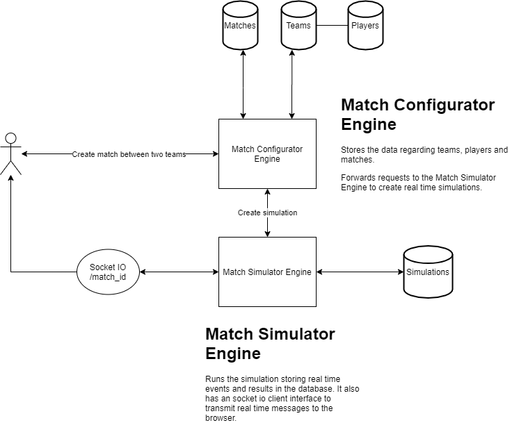
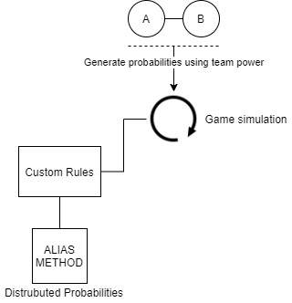

# Football Manager Simulator

This project implements a golang solution that uses microservices to simulate match games between two teams.
Note that the implementation focus on the basic steps to implement one solution of these type, not focusing so much on internal rules to predict results.

## Architecture


**Match Configurator Engine (MCE) Service**

Using HTTP Gin and GORM frameworks for Go I built a simple model architecture that is automatically deployed to the database (Postgres) upon the service start. It also adds mock data to test the application.

**Match Simulator Engine (MSE) Service**

This architecture is a little bit tricky because it has a goroutine on one of the endpoints. This goroutine is used to simulate the match (in my example it's 90 minutes with some more minutes of extra time). Has the architecture as follows



As we can see, upon a match request I create weighted probabilities using the overall team power of each team. Before I start the 90 minutes game I generate the number of events during the match (in this case it will be the minutes) by using a custom rule (if power difference between teams is greater than X then Y, for example).
During the match simulation if the current minute equals to an event I'll generate a random number between 0 and 1 to represent the team probability of that event belongs to them. This is done using a distributed probability method named Alias Method ([My other project](https://github.com/thealmarques/golang-alias-method-weighted-distribution)). In this simulation, there is room to add more custom rules totally depending on you.
All of the generated events are saved in a Postgres database and sent to the user using a socket io connection (this last one is currently in beta phase).

## How to Run

Run this docker command in the root folder.

```console
docker-compose up -d
```

## Todo

[] Add authentication

[] Add more rules to the match simulation

[] Change MCE requests logic to use GORM queries to the database instead of HTTP requests

[] Add socket io server to docker-compose file

[] Finish socket io integration in the simulator
